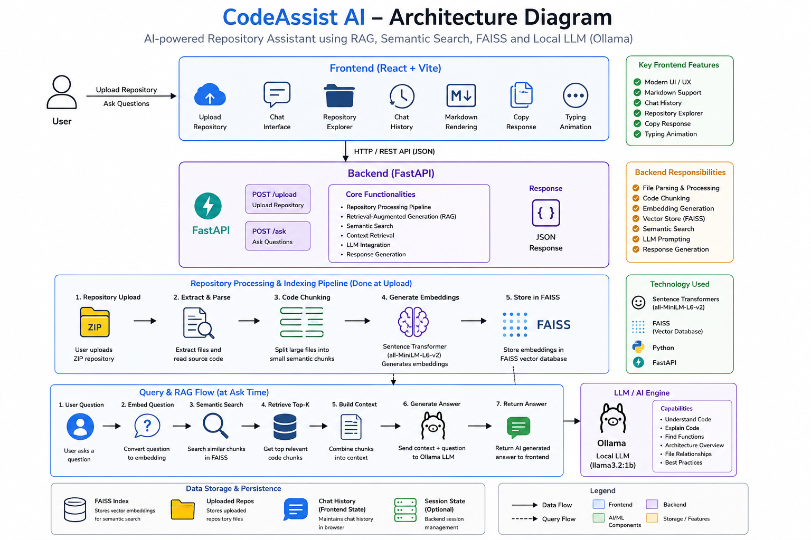
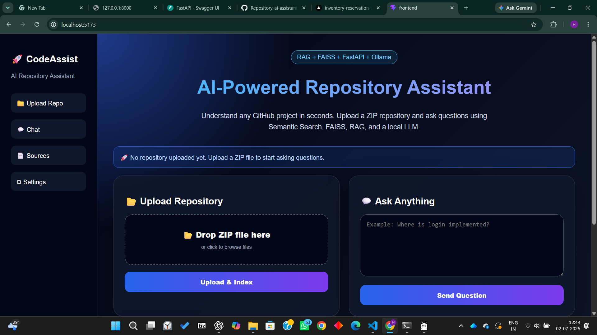
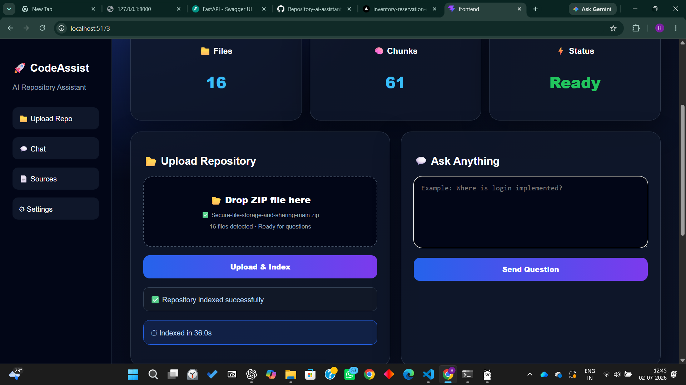
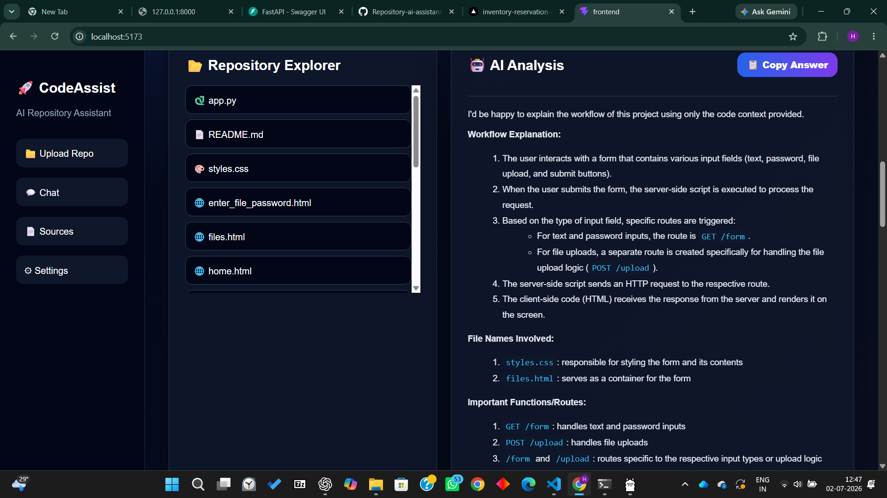
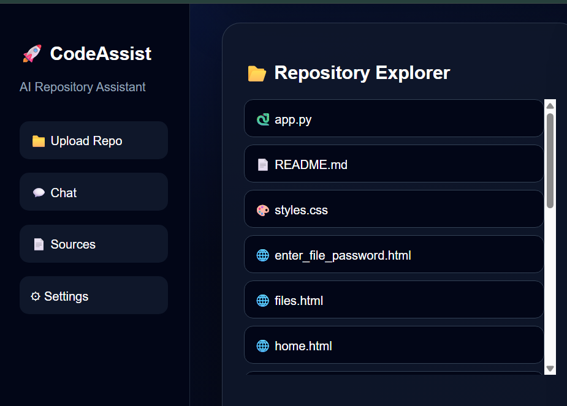
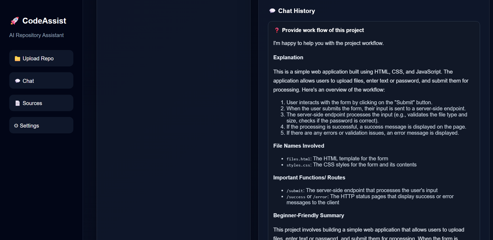

# 🚀 CodeAssist AI

AI-powered Repository Assistant that helps developers understand any codebase using Retrieval-Augmented Generation (RAG), Semantic Search, FAISS, and a Local LLM (Ollama).

---

## ✨ Features

- 📂 Upload any ZIP repository
- 🔍 Semantic code search using Sentence Transformers
- 🧠 FAISS vector database for similarity search
- 🤖 AI-powered repository question answering
- 📄 Markdown formatted responses
- 💬 Chat history
- 📁 Repository explorer
- 📋 Copy AI responses
- ⚡ Typing animation
- 🎨 Modern React dashboard

---

## 🛠 Tech Stack

### Frontend
- React
- Vite
- Axios
- React Markdown
- CSS

### Backend
- FastAPI
- Python
- FAISS
- Sentence Transformers
- Ollama
- NumPy

---

## 🧠 Architecture



---

## 📸 Screenshots


### 🏠 Home



---

### 📂 Repository Uploaded



---

### 🤖 AI Response



---

### 📁 Repository Explorer



---

### 💬 Chat History



---

## 🚀 Installation

### Backend

```bash
cd backend

python -m venv venv

venv\Scripts\activate

pip install -r requirements.txt

uvicorn app.main:app --reload
```

### Frontend

```bash
cd frontend

npm install

npm run dev
```

---

## Running Ollama

```bash
ollama serve
```

Pull model

```bash
ollama pull llama3.2:1b
```

---

## Project Structure

```
backend/
    app/
        routes/
        services/
        utils/

frontend/
    src/
    public/
```

---

## Future Improvements

- GitHub Repository URL Upload
- Multiple Repository Support
- Authentication
- Cloud Deployment
- Conversation Memory

---

## Live Demo

Live URL:repository-ai-assistant.vercel.app 

---

## 👩‍💻 Author

Harini PM

GitHub:
https://github.com/HariniMurali04
